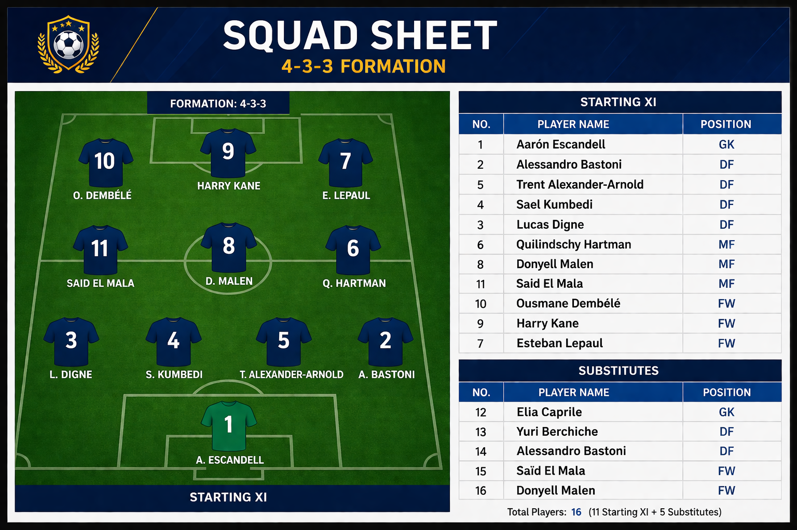

# Football Squad Selection using SQL (4-3-3 Formation)

##  Project Overview
This project focuses on building an optimal football squad using SQL by analyzing player performance data. A data-driven approach is used to select the best **11 starting players and 5 substitutes** based on performance metrics, position roles, and experience levels.

## Objective
To construct a balanced football team using a **4-3-3 formation** by applying SQL-based analysis and ranking techniques.

##  Dataset
The project uses two datasets:

**player_details**
  - player_id
  - player_name
  - position (GK, DEF, MID, FWD)
  - nation (3-letter codes)
  - experience

**player_stats**
  - player_id
  - goals
  - assists
  - fouls

## Data Processing
- Joined datasets using `player_id`
- Filtered players from top European nations
- Cleaned missing and duplicate values

---

## Exploratory Data Analysis (EDA)
- Player distribution by position and nation
- Top goal scorers, assist providers, and goalkeepers
- Performance trends across roles

---

## Scoring Model
A position-based scoring model was implemented:

- **FW:** Goals × 5 + Assists × 3 − Fouls × 2  
- **MF:** Goals × 3 + Assists × 4 − Fouls × 2  
- **DF:** Assists × 2 − Red_cards*1  
- **GK:** Saves × 5 − Fouls × 2 

---

## Team Formation (4-3-3)

- GK: 1  
- DF: 4  
- MF: 3  
- FW: 3  

+ 5 Substitutes

---

## Final Squad

### Starting XI
Aarón Escandell (GK)
Alessandro Bastoni (DEF)
Trent Alexander-Arnold (DEF)
Sael Kumbedi (DEF)
Lucas Digne (DEF)
Quilindschy Hartman (MID)
Donyell Malen (MID)
Said El Mala (MID)
Ousmane Dembélé (FWD)
Harry Kane (FWD)
Esteban Lepaul (FWD)

### Substitutes
Elia Caprile (GK)
Yuri Berchiche (DEF)
Alessandro Bastoni (DEF)
Said El Mala (FWD)
Donyell Malen (FWD)

---

## Key SQL Concepts Used
- JOIN
- GROUP BY
- CASE statements
- Window functions (`ROW_NUMBER`)
- Aggregation & filtering

---

## Tools Used
- SQL (SQLite Online)
- Excel (data handling)

---

## Output

[Final report -- ](Report/SQL_Project_Report.pdf)

[SQL Query -- ](SQL_query/Football_Squad_SQL_query.sql)
---

## Key Insights
- Forwards dominate scoring metrics
- Midfielders provide balanced contributions
- Defensive discipline impacts selection
- Data-driven approach improves decision-making

---

## Conclusion
This project demonstrates how SQL can be used to perform sports analytics and make structured, data-driven decisions in team selection.

---
